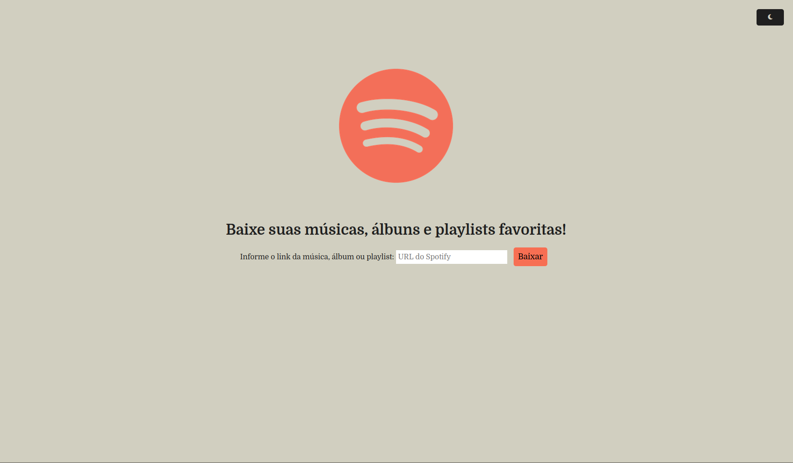

# 🎵 Spotify Music Downloader com Flask + spotDL

Este projeto é uma aplicação web simples feita com **Python + Flask** que permite baixar músicas do **Spotify** usando o [spotDL](https://spotdl.io/). A interface permite inserir uma URL do Spotify e iniciar o download diretamente pelo navegador.



---

## 🚀 Funcionalidades

- Interface web com formulário para colar o link do Spotify;
- Download automático da música via spotDL;
- Mensagens de feedback (sucesso, erro, progresso);
- Organização dos arquivos baixados em uma pasta específica;
- Estrutura moderna com pastas `templates/` e `static/`;
- Modo escuro/claro.

---

## 🖥️ Requisitos

- Python 3.8 ou superior;
- pip;
- O spotDL precisa do ffmpeg instalado no sistema. Certifique-se de que ele está disponível no PATH;
- Não se esqueça de verificar se o SpotDL está atualizado;
- Git (para clonar o projeto).

---

## ⚙️ Como rodar localmente

### 1. Clone o repositório

```bash
git clone https://github.com/EnricoGregorio/SpotifyMusicsDownload.git
cd SpotifyMusicsDownload
```

### 2. Crie e ative um ambiente virtual

```bash
python -m venv .venv
source .venv/bin/activate           # Linux/macOS
.venv\Scripts\activate              # Windows
```

### 3. Instale as dependências

```bash
pip install -r requirements.txt
```

### 4. Execute o aplicativo

```bash
flask run --debug
```

Acesse http://localhost:5000 no navegador.

## 📁 Após baixar as músicas

Basta abrir a pasta `musics/` do programa e acessar os arquivos das músicas baixadas.

## 📜 Licença

Este projeto é livre para uso pessoal e educacional.
